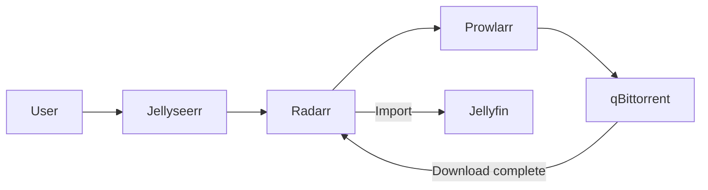

# Download Automation Stack

> **Type**: Docker stack (LXC 109 `download`)
> **Category**: Media – Downloaders & Indexers
> **Role**: Full automated pipeline for downloading, organizing, and enriching media content

---

## 🧩 Overview

This stack includes torrent & Usenet clients, indexers, and automation tools for movies, series, books, and music.
When a user submits a request (e.g. via Jellyseerr), the chain of tools locates and downloads the file, then renames, enriches, and organizes it.

---

## ⚙️ Components & Roles

| Service         | Role                | Web Port | Notes                                |
| --------------- | ------------------- | -------- | ------------------------------------ |
| **qBittorrent** | Torrent client      | **8080** | Handles torrent downloads            |
| **NZBGet**      | Usenet client       | **6789** | Handles NZB downloads                |
| **Prowlarr**    | Indexer aggregator  | **9696** | Feeds indexers to Sonarr/Radarr/etc. |
| **Sonarr**      | TV‑show automation  | **8989** | Connects to qBittorrent/NZBGet       |
| **Radarr**      | Movie automation    | **7878** | Same, for movies                     |
| **Lidarr**      | Music automation    | **8686** | Same, for albums                     |
| **Readarr**     | Book automation     | **8787** | Handles e‑books & audiobooks         |
| **Bazarr**      | Subtitle management | **6767** | Adds/updates subtitles               |

All services share the `/data` mount so they can read and move downloaded media.

---

## 🔁 Workflow Example

The same logic applies to Sonarr (TV), Lidarr (music), and Readarr (books).

---

## 📦 Configuration Storage

| Host Folder     | Used by     | Container Path |
| --------------- | ----------- | -------------- |
| `./qbittorrent` | qBittorrent | `/config`      |
| `./nzbget`      | NZBGet      | `/config`      |
| `./prowlarr`    | Prowlarr    | `/config`      |
| `./sonarr`      | Sonarr      | `/config`      |
| `./radarr`      | Radarr      | `/config`      |
| `./lidarr`      | Lidarr      | `/config`      |
| `./bazarr`      | Bazarr      | `/config`      |
| `./readarr`     | Readarr     | `/config`      |

All services mount `/data`, which is the central media location also used by Jellyfin.

---

## 🔐 Access & Reverse Proxy

Each service is proxied through Nginx Proxy Manager with HTTPS:

* `qbit.vanhome.online`
* `nzb.vanhome.online`
* `radar.vanhome.online`
* `sonar.vanhome.online`
* `lidarr.vanhome.online`
* `readarr.vanhome.online`
* `prowlarr.vanhome.online`
* `bazarr.vanhome.online`

LAN hosts can also reach the original ports directly.

---

## 🗃️ Backup Strategy

| Item                      | Method                                         | Frequency     |
| ------------------------- | ---------------------------------------------- | ------------- |
| **Config folders**        | Included in nightly rsync + Proxmox vzdump     | Daily         |
| **Downloaded media**      | ZFS snapshots + external HDD sync              | Daily         |
| **Prowlarr indexer list** | Export via UI (`Settings → Indexers → Backup`) | After changes |

---

## 📝 Notes

1. Set `PUID/PGID` to match the media user (`1000:1000`) so containers can manage files.
2. Create categories in qBittorrent/NZBGet (e.g. `tv-sonarr`, `movies-radarr`) for cleaner post‑processing.
3. Bazarr integrates directly with Jellyfin for auto‑subtitle syncing.
4. Keep an eye on **free disk space**—Radarr/Sonarr can be configured to delete original archives after import.
5. Use HTTPS & auth in NPM if exposing any service outside the LAN.
