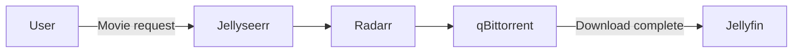

# Jellyfin (+ Jellyseerr)

> **Type**: Docker stack (LXC 102 `media-server`)  
> **Category**: Media – Playback  
> **Role**:  
> • **Jellyfin** – self-hosted media-server for movies, shows, music  
> • **Jellyseerr** – request portal & approval flow for Jellyfin users  

---

## 🧩 Overview
- **Jellyfin** streams local media over HTTP/HTTPS to TVs, browsers, mobile apps, and DLNA clients.  
- **Jellyseerr** lets friends request new content; approved items are forwarded to Radarr/Sonarr → qBittorrent/NZBGet.  

Both services run in one compose stack and share the same `PUID/PGID = 1000` so containers can read/write the host’s `/data` library.

---

## ⚙️ Specifications

| Setting                              | Jellyfin                                    | Jellyseerr                  |
|--------------------------------------|---------------------------------------------|-----------------------------|
| Image                                | `lscr.io/linuxserver/jellyfin:latest`       | `fallenbagel/jellyseerr:latest` |
| Ports                                | **8096/tcp** (HTTP), 7359/udp, 1900/udp     | **5055/tcp**                |
| Volumes                              | `./config → /config` `/data → /data`     | `./jellyseerr → /app/config` |
| Hardware acceleration                | Intel QuickSync via `/dev/dri` + groups 44/993 | –                           |
| Env TZ                               | `Ukraine/Kyiv`                              | `Ukraine/Kyiv`              |
| Advertised URL (optional)            | `JELLYFIN_PublishedServerUrl`               | N/A                         |
| Restart policy                       | `unless-stopped`                            | `unless-stopped`            |

> **Public access**: both services are proxied through Nginx Proxy Manager (`jellyfin.vanhome.online` and `jellyserr.vanhome.online`) with HTTPS.

---

## 💾 Storage Layout

| Host Path | Purpose              |
|-----------|----------------------|
| `/data/movies`  | Movies          |
| `/data/tv`      | TV shows        |
| `/data/music`   | Music library   |
| `/data/photos`* | (optional) Photos |

All media is mounted read-write so Jellyfin can update metadata and Jellyseerr can create `.nfo` request markers.

---

## 🔐 Users & Access

| Service     | Auth method              | Notes                               |
|-------------|--------------------------|-------------------------------------|
| Jellyfin    | Local users + PIN/LDAP*  | Admin user `van` manages libraries  |
| Jellyseerr  | Jellyfin SSO (API token) | Normal users submit requests        |

*LDAP planned; currently only local accounts.

---

## 🗺️ Request Workflow

## 🗃️ Backup
Configs: ./config and ./jellyseerr folders → daily Proxmox vzdump + rsync to backup drive

Media: covered by separate ZFS snapshots and external HDD sync

## 📝 Notes
QuickSync already enabled — confirm HW transcodes under Dashboard → Playback (look for vaapi / qsv).

Service discovery (1900 UDP, 7359 UDP) is LAN-only; safe to expose via host network.

If you add 4K content, tweak Transcoding — Advanced (throttling, CRF).
